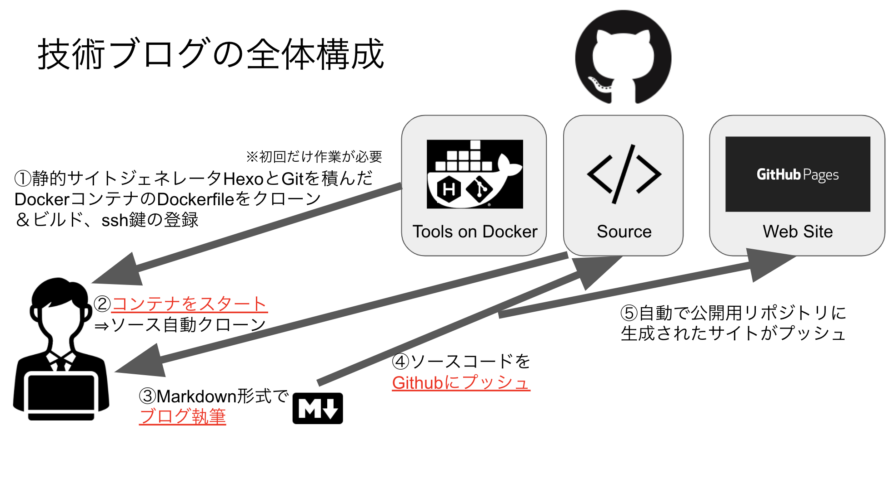

# はじめに

MONET Technologies株式会社、2020年新卒入社の竹内です。

この度、弊社でも社員の技術力向上&アウトプットのために、技術ブログを開設する運びとなりました。

記念すべき1回目の記事は、この技術ブログの立ち上げについて一通り書きます。

## 技術ブログの選定

技術ブログを作成するに当たって考えたのは、

1. サーバの維持コスト
2. 記事の管理コスト
3. 執筆環境

の3点です。技術ブログを公開するというということは当然Webサーバが必要になるわけですが、そこにコストやメンテナンスが必要になると継続するのが面倒です。なので、何か外部のサービスを使って公開したいという要求があります。
また、ページを編集したら、編集履歴や差分まで管理したいです。
更に、執筆環境としては、普段コードを書いたりするエディタを使ってそのまま書きたいですよね。

ということで、今回は静的サイトジェネレータ[Hexo](https://hexo.io/)と[Github Pages](https://pages.github.com/)を使って技術ブログを作ってみることにしました。ただ、今回用いるHexoはNode.jsで作られており、バージョン管理などが面倒です。そこで、今回は、

- 生成環境：Docker上のHexo
- 執筆環境：Visual Studio Codeなどの各自のエディタ
- 公開環境：Github Pages

という構成で全体を組みました(もちろん執筆環境はお好きなエディタを使ってください)。

全体構成のイメージはこんな感じです。

次回からそれぞれの環境について執筆していきます。

# まとめ

技術ブログを始めるので皆様ゆるゆるとお付き合いください!