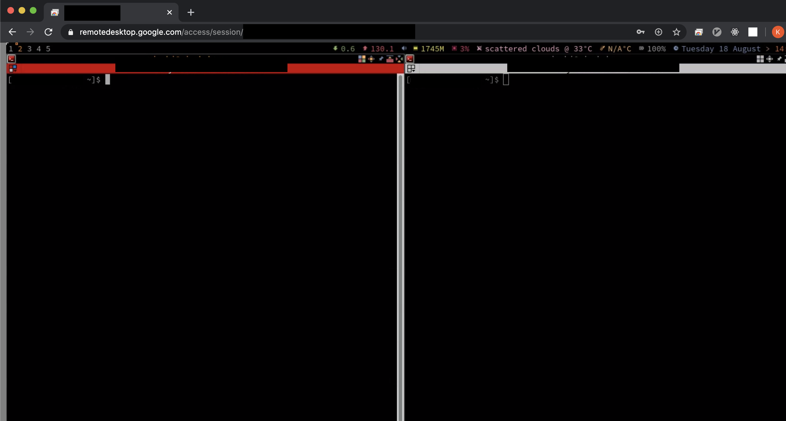

# はじめに

MONET Technologies株式会社、2020年新卒入社の竹内です。

この記事では、自分のおすすめする　LinuxディストリビューションであるArch Linuxについてちょろっと書かせて頂きます。

## Arch Linuxが好きです。

エンジニアなら一度は辿り着く境地、 **「オレオレカスタマイズしたマイスイートPCを作りたい」**

自分はハードウェアがそこそこのPCに、どんなソフトを載せるか、というところが好きです
(自作PC勢のお話も是非聴いてみたいですが)。

そんな自分が大学生の時からお世話になっているのが、
[Arch Linux](https://www.archlinux.jp/)というLinuxのディストリビューションです。

## 何がいいの?

- めちゃくちゃ軽量&爆速(個人の感想です)
- パッケージマネージャが優秀(ほとんどのソフトを一つのパッケージマネージャで完結できて嬉しい)
- 最初にミニマムな要素(CLI環境)しか入っていないので、ウィンドウマネージャなどを自分の好みで入れられる

この辺が自分のツボです。特に、高校生の頃に買った弱いPCにArchを入れた時、あんなにWindowsが重かったのが爆速で動くようになった感動を今でも忘れられません。

## まぁ諸説あるけど

とはいえ、確かに、 **少しメンテナンスが面倒くさい** こともあるかもしれません。
特に、Archには始め殆どの要素は入っていない状態からスタートするので、デスクトップ環境を構築するまでが面倒だったり、カーネルのアップデートで起動しなくなったり、ということも無くはないです。

が、手のかけた子ほど可愛い、そう思いませんか?(個人の意見です)

何か問題が起きたとしても、[Arch Wiki](https://wiki.archlinux.jp/index.php/%E3%83%A1%E3%82%A4%E3%83%B3%E3%83%9A%E3%83%BC%E3%82%B8)がかなり優秀なので、大抵なんとかなります。

余談ですが、Ubuntuなど別のLinuxディストリビューションを使ってもArch Wikiの情報で助かったりするので、優秀なドキュメントになっているなと感じます。

## おすすめのウィンドウマネージャ

せっかくなので、Arch Linux上での構成を少しだけお話します。

自分はウィンドウを画面一杯、もしくは二つのウィンドウを右と左に分けて、と言った感じで敷き詰めるのが好きなので、タイル型のウィンドウマネージャが好きです。

自分のPCに入れているのは、[awesome](https://awesomewm.org/)というウィンドウマネージャです。
こちらを使うと、ショートカットキーで

- ウィンドウの配置
- フォーカスの切替

などが簡単にできるので好みです。

さらに、google-chromeの[remote desktop](https://support.google.com/chrome/answer/1649523?co=GENIE.Platform%3DDesktop&hl=ja)も入るので、自宅のPCにArch Linuxを入れて、リモートデスクトップを経由して手元のPCから作業、なんてこともできます。

リモートデスクトップの割に爆速で、中でどんな仕組みになっているか気になっちゃいますね。。。

# まとめ

Arch Linuxはいいぞ。