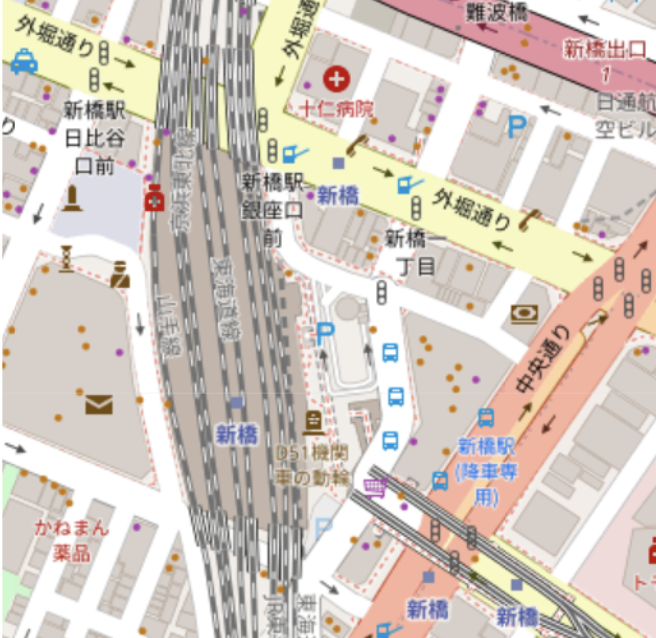
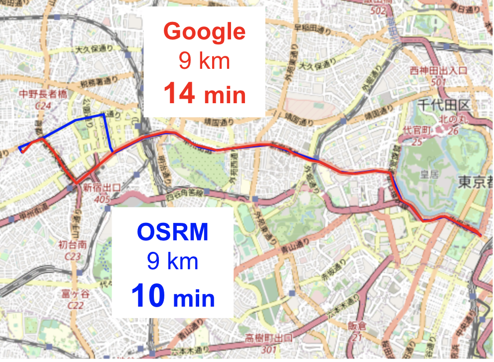
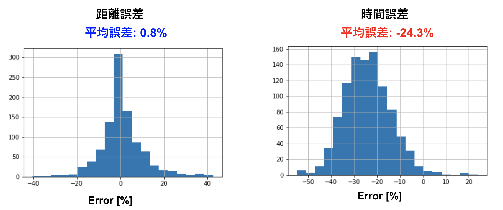
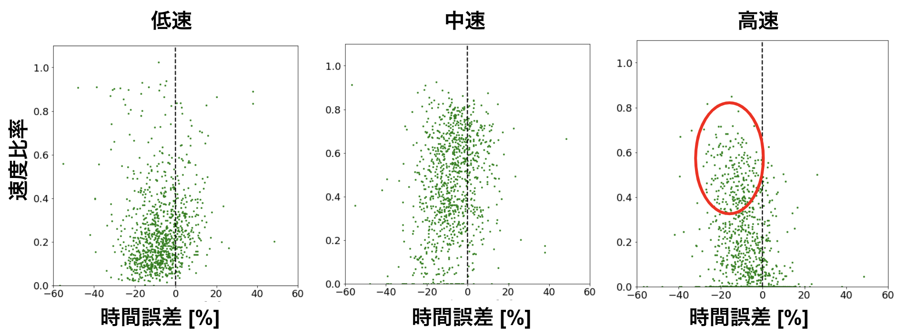
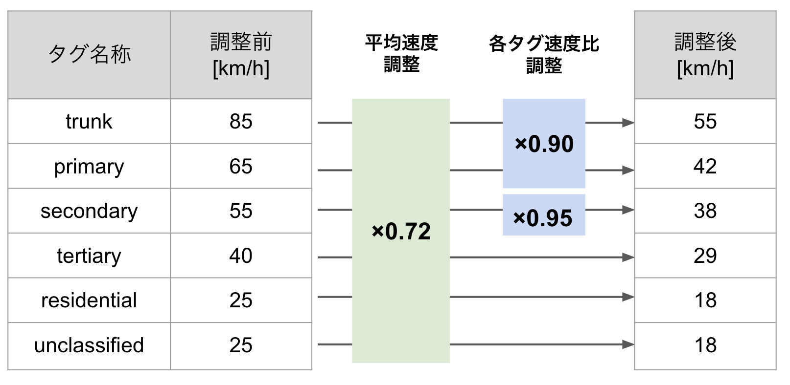
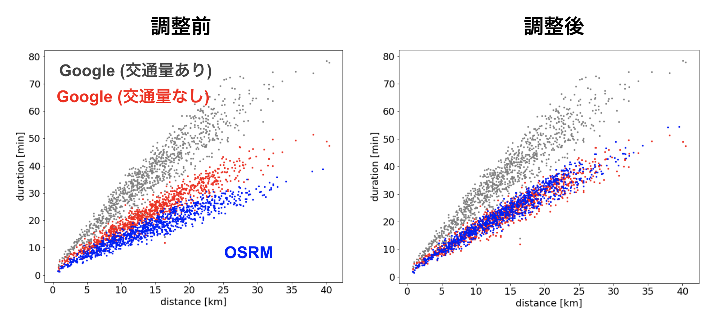
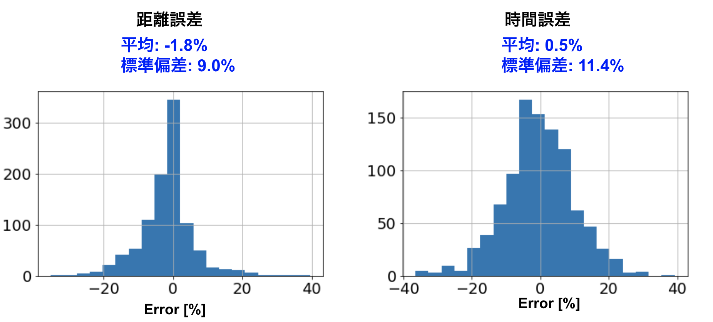

システム部の登山担当太田です  
山はいいぞ

今回はルート検索のOSSであるOSRMを検証した話です
地図データにはOSMを用いています
導入は別で書きます

# 前談

## ルート検索のコスト削減
MONETではオンデマンドバスサービスを提供していますが
その裏ではルート検索による時間取得のロジックが何度もはしっています
マッチングの最適化など今後進めていくにあたってもルート検索のコストは抑えたいところです
そこで信頼性をある程度担保して低コストなルート検索できないかな？
ということでOSSの有効性を検証しました

## OSMとは
素晴らしい取り組みとしてOpen Street Map (OSM) という地理情報をみんなで作って行こうぜ！オープンライセンスで誰にでも使えるようにしようぜ！というイカしたプロジェクトがあります
Open Street Mapでは所々足りていない情報はありますが
道路のクラス分けや店舗の情報までオープンライセンスと考えれば十分すぎるほどの地理データが利用できます

|    |  OSMで利用可能な情報  |
| ---- | ---- |
|  ○  |  道路分類, 建物分類, 各名称  |
|  ×  |  公共交通機関, 交通量  |
  

もちろん自分たちで編集ができ, 自宅の周りとか眺めてポチポチするだけで世界の地理データベース作成に貢献できるのでぜひやってみてください！

## OSRMとは
ルート検索エンジンのOSSです.
中身のアルゴリズムはmulti dikstraでOSMの地図情報を基に
最短ルートを決定します. (他のアルゴリズムも使用可)
高速道路を省いたり, Uターンを禁止したりなど
痒いところの設定までできてしまう優れものです.
Mapboxでも採用されていたりします.[ブログ記事](https://blog.mapbox.com/mapbox-directions-powered-by-osrm-4-8-1-cf2c45ae9aa8)
ルート検索だけでなく
MapBoxでも採用されていたりします
このルート検索エンジン使ってどれくらい正しく予測できるの？
というのが今回のお題です

## OSRMってどんな感じで動いてますん
実装までは[他記事]()でも紹介されているので省きますが
ザクっとこんな感じです
1. OSMの最新地図情報を保存
1. luaファイル定義に従って重み付けされたグラフを作成
1. HTTPサーバーを起動してリクエスト

# 検証
最初に東京都内の限られた範囲でランダムに2点を
限られた範囲でのルート検索制度を検証しました.
検証範囲は以下になります.

この中で1000回程度Google Direction API, OSRM APIどちらも叩いて統計差がどれくらいか, 変なルート通っていないか比較しました.

設定はこんな感じです
- 両方とも高速道路を通らない
- Direction APIはtrafficMode=optimistic
- OSRMは交通量情報を考慮しない
- OSRMの設定luaファイルはデフォルト (car.lua) のまま

# 結果
## 予測結果
ランダムに1つ抜き出してきました.
ルートは似たようなルートを通っていますが
時間が結構ずれています.

## 距離誤差＆時間誤差
距離/時間の相対誤差のヒストグラムは以下のようになりました.

ルート可視化と同様に, 距離誤差はデフォルトでもある程度正しいですが
時間誤差が大きいので修正が必要です.

## 速い道路, 遅い道路の区分け
適当に低速, 中速, 高速で分けると
高速の比率が大きいほど予測を外していることが分かりました.

# チューニング
上記の結果を踏まえてチューニングを行いました.
luaファイル内では道路のタグ名ごとに初期設定速度を入れています.
今回はそちらを定数倍する大雑把な修正を行いました.

これで統計的な情報をある程度合わせられる！(チューニングですので)

# チューニング結果
こんな感じになりました  
散布図

ヒストグラム

平均はあるていど合わせられましたが分散までGoogleの予測と同様とはやはり行かなかったです.
交通量の考慮も入ってくるのでそのままの代用は難しいですね.
一方, 大きく外すわけではないので裏のロジックに使用したりとか
使い道を考えれば導入できるのでは？という感触でした

# まとめ
Googleと比較して検証しました
全体大きくは外さないですがダメな時もありました
どこまでの精度求めるかによりますが
存外使えるかもという事で裏側ロジックでの実装と導入
どの部分に使うかを模索することになりました.

