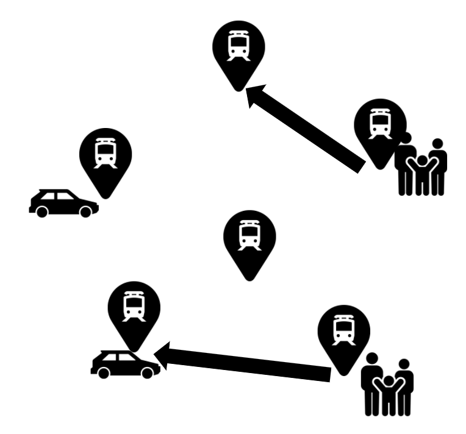

# はじめに

システム部の竹内です。

今回の記事では、少し真面目に理論的なことを考えていきたいと思います。

MONETではオンデマンドバスを提供するパッケージを提供していますが、
配送の最適化は昔から学術的にも考えられている問題です。

今回は理論的に最適化問題を解く流れを見ながら、
配送最適化のエッセンスを感じていただければと思います。

## 一般的にオンデマンドバスを捉える

まず、そもそも「オンデマンドバスの最適化」とはどんな問題なのでしょうか。
最適化問題を理論的に考えるときには、まず、

1. 何が事前情報として与えられるのか
2. 何を決定するのか
3. どんな観点で決定を評価するのか

と言った観点を明らかにする必要があります。

今回考えたいオンデマンドバスのシチュエーションでは、例えば、

**何が事前情報として与えられるのか：**
- バスが何台か存在する
  - 一度に運べる乗客の積載容量は決まっている
- 乗客が乗降するための駅が何箇所か存在する
  - 駅間には距離が定義される
- 利用希望の乗客が何人か存在する
  - 出発駅と到着駅のペア

**何を決定するのか：**
- 乗客が、いつ、どの車に乗るか(配車割当)
- 車が、どのような経路で駅間を移動するか(配送経路)

**どんな観点で決定を評価するのか：**
- 全ての車の配送経路の総和

として整理することができます。



もちろん、問題の捉え方によっては、他の整理の仕方があります。
例えば、乗客が決まった出発駅を持たず、現在地から近ければ近いほど好ましい状況、というシチュエーションも考えられます。

ただ、いずれにせよ、最適化を理論的に考える場合には、最低限上記の3点を明確に正しく把握しておくことは重要です。

## よくある運搬経路最適化問題(VRP)

上記問題の詳細を考える問題として、
運搬経路最適化問題(Vehicle Routing Problem)があります。
この問題は、巡回セールスマン問題を複数人で分担して行うことを考える問題になっています。

理解しやすい解説として、以下のQiita記事がよくまとまっています。

[運搬経路問題（配送最適化問題，Vehicle Routing Problem) をPuLPで解く](https://qiita.com/r_nsd/items/19dcb30f5478384f90d3)

VRPの特徴として、

- 全てのバスは車庫から出発して車庫に戻ってくる
- 計画を立てるタイミングで全ての予約が出揃っている

などの問題設定がなされています。

こちらも重要なポイントですが、
実社会にみられる問題は、既に考えられている問題に帰着できる場合があります。
このとき、帰着先の問題において、問題設定にどのような前提があるのかをよく理解しながら帰着させることが重要です。

今回の問題をVRPとして捉えると、
- バスはキャパシティを持つ
- 乗客は出発地と目的地を持つ

という観点から、VRPの派生問題であるCVRPPD(Capacitated VRP with Pick-up and Delivery)という問題として捉えることができます。

## VRPのソルバー

考えている問題が何か有名な問題に帰着できる場合(今回はVRP)、多くの場合既にソルバー(問題を解くためのプログラム/アルゴリズム)が存在します。

今回考えているVRPには、
[OR-tools](https://developers.google.com/optimization/routing/vrp)
というOSSソルバーが存在しています。

こちらのようなソルバーを使うと、CVRPPDをプログラムに落とし込むことができます。
つまり、駅や車のキャパシティ、乗客の出発地、目的地などのパラメータを与えることによって、
プログラムを用いて最適な配送計画を計算することができます。

ただし、利用するソルバーによっては、
- 与えられるパラメータに制限がつく
  - 各駅について、高々一人が出発地または目的地に設定する(出発地、目的地の重複がない)状況しか考えられない
  - 駅数などパラメータの数に制限がつく
- 処理時間はソルバー依存

と言った問題点が出てくる場合もあります。

ここでのポイントとしては、
- 考えている問題の規模によって、ソルバーを選ぶ必要がある
  - パラメータの数、処理時間の要求
- 帰着させた問題によっては、ソルバーにあう形で新たな制限(仮定)を置かなければならない場合がある
- 何らかの高速なソルバーが存在する場合には、帰着させる問題を工夫して、ソルバーで解きやすい形の問題に帰着させることも考慮する

といったものが挙げられます。

## 実際のプログラム

せっかくなので、OR-toolsを使ってCVRPPDを解くプログラムをみてみます。

```python src.py
from __future__ import print_function
from ortools.constraint_solver import routing_enums_pb2
from ortools.constraint_solver import pywrapcp


def create_data_model():
    data = {}
    # 17箇所の駅
    data['distance_matrix'] = [
        [   0,  548,  776,  696,  582,  274,  502, 194,  308, 194,  536,  502,  388,  354,  468,  776,  662],
        [ 548,    0,  684,  308,  194,  502,  730, 354,  696, 742, 1084,  594,  480,  674, 1016,  868, 1210],
        [ 776,  684,    0,  992,  878,  502,  274, 810,  468, 742,  400, 1278, 1164, 1130,  788, 1552,  754],
        [ 696,  308,  992,    0,  114,  650,  878, 502,  844, 890, 1232,  514,  628,  822, 1164,  560, 1358],
        [ 582,  194,  878,  114,    0,  536,  764, 388,  730, 776, 1118,  400,  514,  708, 1050,  674, 1244],
        [ 274,  502,  502,  650,  536,    0,  228, 308,  194, 240,  582,  776,  662,  628,  514, 1050,  708],
        [ 502,  730,  274,  878,  764,  228,    0, 536,  194, 468,  354, 1004,  890,  856,  514, 1278,  480],
        [ 194,  354,  810,  502,  388,  308,  536,   0,  342, 388,  730,  468,  354,  320,  662,  742,  856],
        [ 308,  696,  468,  844,  730,  194,  194, 342,    0, 274,  388,  810,  696,  662,  320, 1084,  514],
        [ 194,  742,  742,  890,  776,  240,  468, 388,  274,   0,  342,  536,  422,  388,  274,  810,  468],
        [ 536, 1084,  400, 1232, 1118,  582,  354, 730,  388, 342,    0,  878,  764,  730,  388, 1152,  354],
        [ 502,  594, 1278,  514,  400,  776, 1004, 468,  810, 536,  878,    0,  114,  308,  650,  274,  844],
        [ 388,  480, 1164,  628,  514,  662,  890, 354,  696, 422,  764,  114,    0,  194,  536,  388,  730],
        [ 354,  674, 1130,  822,  708,  628,  856, 320,  662, 388,  730,  308,  194,    0,  342,  422,  536],
        [ 468, 1016,  788, 1164, 1050,  514,  514, 662,  320, 274,  388,  650,  536,  342,    0,  764,  194],
        [ 776,  868, 1552,  560,  674, 1050, 1278, 742, 1084, 810, 1152,  274,  388,  422,  764,    0,  798],
        [ 662, 1210,  754, 1358, 1244,  708,  480, 856,  514, 468,  354,  844,  730,  536,  194,  798,    0],
    ]
    # 8人分の予約(ODペア)が発生
    data['pickups_deliveries'] = [
        [1, 6],
        [2, 10],
        [4, 3],
        [5, 9],
        [7, 8],
        [15, 11],
        [13, 12],
        [16, 14],
    ]
    # 車が4台
    data['num_vehicles'] = 4
    # 各駅について、出発駅として設定されている場合は需要1、
    # 到着駅として設定されている場合には需要-1(降りることを表現)
    data['demands'] = [0, 1, 1, -1, 1, 1, -1, 1, -1, -1, -1, -1, -1, 1, -1, 1, 1]
    # 各車の最大積載容量
    data['vehicle_capacities'] = [3, 3, 3, 3]
    # 車庫
    data['depot'] = 0
    return data


def print_solution(data, manager, routing, solution):
    """Prints solution on console."""
    total_distance = 0
    for vehicle_id in range(data['num_vehicles']):
        index = routing.Start(vehicle_id)
        plan_output = 'Route for vehicle {}:\n'.format(vehicle_id)
        route_distance = 0
        while not routing.IsEnd(index):
            plan_output += ' {} -> '.format(manager.IndexToNode(index))
            previous_index = index
            index = solution.Value(routing.NextVar(index))
            route_distance += routing.GetArcCostForVehicle(
                previous_index, index, vehicle_id)
        plan_output += '{}\n'.format(manager.IndexToNode(index))
        plan_output += 'Distance of the route: {}m\n'.format(route_distance)
        print(plan_output)
        total_distance += route_distance
    print('Total Distance of all routes: {}m'.format(total_distance))


def main():
    """Entry point of the program."""
    # Instantiate the data problem.
    data = create_data_model()

    # Create the routing index manager.
    manager = pywrapcp.RoutingIndexManager(len(data['distance_matrix']),
                                            data['num_vehicles'], data['depot'])

    # Create Routing Model.
    routing = pywrapcp.RoutingModel(manager)

    # Define cost of each arc.
    def distance_callback(from_index, to_index):
        """Returns the manhattan distance between the two nodes."""
        # Convert from routing variable Index to distance matrix NodeIndex.
        from_node = manager.IndexToNode(from_index)
        to_node = manager.IndexToNode(to_index)
        return data['distance_matrix'][from_node][to_node]

    transit_callback_index = routing.RegisterTransitCallback(distance_callback)
    routing.SetArcCostEvaluatorOfAllVehicles(transit_callback_index)

    # Add Distance constraint.
    dimension_name = 'Distance'
    routing.AddDimension(
        transit_callback_index,
        0,  # no slack
        2500,  # vehicle maximum travel distance
        True,  # start cumul to zero
        dimension_name)
    distance_dimension = routing.GetDimensionOrDie(dimension_name)
    distance_dimension.SetGlobalSpanCostCoefficient(100)

    def demand_callback(from_index):
        """Returns the demand of the node."""
        # Convert from routing variable Index to demands NodeIndex.
        from_node = manager.IndexToNode(from_index)
        return data['demands'][from_node]

    demand_callback_index = routing.RegisterUnaryTransitCallback(demand_callback)
    routing.AddDimensionWithVehicleCapacity(
        demand_callback_index,
        0,  # null capacity slack
        data['vehicle_capacities'],  # vehicle maximum capacities
        True,  # start cumul to zero
        'Capacity')


    # Define Transportation Requests.
    for request in data['pickups_deliveries']:
        pickup_index = manager.NodeToIndex(request[0])
        delivery_index = manager.NodeToIndex(request[1])
        routing.AddPickupAndDelivery(pickup_index, delivery_index)
        routing.solver().Add(
            routing.VehicleVar(pickup_index) == routing.VehicleVar(
                delivery_index))
        routing.solver().Add(
            distance_dimension.CumulVar(pickup_index) <=
            distance_dimension.CumulVar(delivery_index))

    # Setting first solution heuristic.
    search_parameters = pywrapcp.DefaultRoutingSearchParameters()
    search_parameters.first_solution_strategy = (
        routing_enums_pb2.FirstSolutionStrategy.PARALLEL_CHEAPEST_INSERTION)

    # Solve the problem.
    solution = routing.SolveWithParameters(search_parameters)

    # Print solution on console.
    if solution:
        print_solution(data, manager, routing, solution)


if __name__ == '__main__':
    main()
```

結構長々と書いてあって小難しく見えますが、
実際このプログラムの重要なところは```create_data_model()```の中で、
問題のパラメータ(駅の数など)はこちらで指定できます。
ここまでできれば、あとはソルバーがよしなに解いてくれます。

実行結果としては、
```
Route for vehicle 0:
 0 ->  13 ->  15 ->  11 ->  12 -> 0
Distance of the route: 1552m

Route for vehicle 1:
 0 ->  5 ->  2 ->  10 ->  16 ->  14 ->  9 -> 0
Distance of the route: 2192m

Route for vehicle 2:
 0 ->  7 ->  1 ->  6 ->  8 -> 0
Distance of the route: 1780m

Route for vehicle 3:
 0 ->  4 ->  3 -> 0
Distance of the route: 1392m

Total Distance of all routes: 6916m
```
として出力されます。

このような一連の流れで、最適化問題は実際に解くことができます。

一点注意したいのが、ソルバーによっては、導き出される解がグローバルに最適解でない
(ちょっと解を弄るだけでは状況を改善できないが、実は全く別の解を持ってくると改善される)可能性も存在します。
グローバルな最適解かどうかは、ソルバーのアルゴリズムに依存するので、
どうしてもグローバルな最適解が必要な場合は注意が必要です。
ただし、**グローバルな最適解が本当に必要か**、という観点もまた重要です。
例えば、処理時間を1日かけて0.01%改善する解を得ることは、
学術的には意味があるかもしれませんが、実際の社会に組み込む視点で見るとどうでしょう。
それよりも、数秒で90%の結果を得る方が、価値がある場合もありそうです。

# まとめ

最適化をするときは、
1. 問題から与えられる情報と目的、決定する項目を明らかにする
2. 有名な問題/解きやすい問題に帰着できないか検討
3. 問題をプログラムに落とし込んでソルバーに投げる
4. 出てきた解を解釈/利用する

といった流れを組みます。
なかなか奥が深いですね。

# 終わりに

今回は問題をVRPに帰着しましたが、オンデマンドバスのシステム構成によっては、
VRPに帰着すると不都合な点もいくつかあります。
そのような場合には、VRPに帰着せず、より詳細に問題を定式化する必要があります。
そちらは、また他の記事でご紹介できればと思います。


